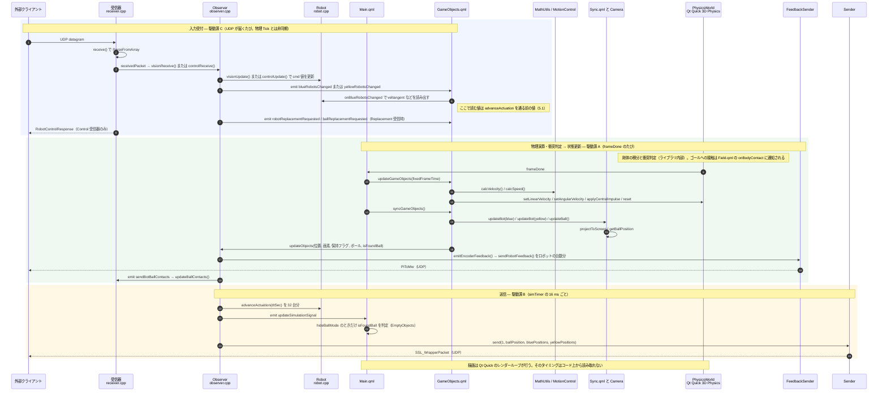

# ssl-RAVEN-sim 技術資料（構造把握・不具合調査用）

| 項目 | 内容 |
|---|---|
| 対象 | 作業ツリー（ベース `6fc530e` + 未コミットの Glass Field 変更） |
| 作成日 | 2026-09-17 |
| 調査範囲 | `main.cpp` / `src/**` / `proto/pb_src/*.proto` / `config/*.ini` / `CMakeLists.txt` |
| 規模 | C++ 1,988 行 / QML 3,585 行 |

### 記述ルール

- 本文には、コードを読んで確認した事実だけを書いている。推測で補ったところは無い。
- コードから確定できない点は **「コード上から読み取れない」** と明記した。
- 「帰結」と書いたところは、そこに挙げた事実だけから論理的に導けることに限っている。
- `ファイル:行` の行番号は、上記の作業ツリー時点のもの。
- Qt / Qt Quick 3D Physics / Protobuf / Boost.Asio の内部動作は本リポジトリのコードに含まれないため、踏み込んでいない。

### 本資料に反映していないもの

- `origin/master`（`5613d27`）で入った変更: `src/qml/settings/CrossMenu.qml`, `src/qml/settings/HBMenu.qml`, `CLAUDE.md`, `ai/findings/*`
- 未マージのリモートブランチ: `fix/teleport-missing-robot-guard`, `feat/racoon-pi-camera-sensors`, `feat/windows-support`, `feat/vision-broadcast-send`

### 目次

1. [システム概要とアーキテクチャ全体像](#1-システム概要とアーキテクチャ全体像)
2. [ディレクトリ／ファイル一覧と責務](#2-ディレクトリファイル一覧と責務)
3. [メインループのライフサイクル](#3-メインループのライフサイクル)
4. [外部通信・インターフェース定義](#4-外部通信インターフェース定義)
5. [付録: コード上で確認できた不整合](#5-付録-コード上で確認できた不整合)

---

## 1. システム概要とアーキテクチャ全体像

### 1.1 概要

RoboCup SSL 向けのロボットサッカーシミュレータ。ビルド成果物は実行ファイル `m2-Sim` 1 つだけ（`CMakeLists.txt` の `add_executable(m2-Sim ...)`）。

依存ライブラリ（`CMakeLists.txt` の `find_package`）:

- Qt 6: Core / Gui / Widgets / Network / Quick / Quick3D / Quick3DPhysics / Qml
- Boost（送信側の UDP に `boost::asio` を使用）
- Protobuf（`proto/pb_src/*.proto` の 18 ファイルすべてを `protobuf_generate_cpp` で生成）

処理の分担:

| 層 | 担当 | 根拠 |
|---|---|---|
| C++ | UDP の送受信、設定ファイルの読み書き、ロボット指令の保持、駆動遅延モデル、ホイールエンコーダ値の合成、座標投影、数値ユーティリティ | `src/**/*.cpp` |
| QML | 3D シーンの構築、剛体の生成と速度設定、キックとドリブル、ボール摩擦モデル、接触時の表示、UI | `src/qml/**` |
| Qt Quick 3D Physics | 剛体の積分と衝突判定 | `Main.qml:42` の `PhysicsWorld`。アルゴリズムはライブラリ内部にあり、コード上から読み取れない |

C++ と QML の境界:

- **起動**: `main.cpp` の `M2Sim::M2Sim()` が `Observer` / `Camera` / `MotionControl` / `MathUtils` を QML モジュール `M2 1.0` に登録し（`main.cpp:16-19`）、`../src/qml/Main.qml` をロードする（`main.cpp:21, 36`）。
- **`Observer` を生成するのは QML 側**。C++ 側では生成しておらず、`Main.qml:141` の `Observer { id: observer }` で生成される。
- **C++ → QML**: `Observer` の `Q_PROPERTY` と signal。`Robot` は QML 型として登録されていないが、`Observer` の `blue_robots` / `yellow_robots`（`QList<QObject*>`）を通して `Q_PROPERTY` が読まれる（`GameObjects.qml:61-78`）。
- **QML → C++**: `observer.updateObjects(...)`（`GameObjects.qml:600`）、`Observer` の `Q_PROPERTY` への書き込み（`Setting.qml:156-187`、`Main.qml:529-538`）、`Camera` / `MathUtils` / `MotionControl` の `Q_INVOKABLE` 呼び出し。

### 1.2 モジュール間の依存関係

凡例: 実線 = 生成・呼び出し、破線 = ファイル I/O、太線 = ネットワーク

```mermaid
graph TD
    subgraph EXT["外部プロセス"]
        X_CMD["コマンド送信元<br/>mocSim_Packet"]
        X_BLUE["青チーム制御クライアント<br/>RobotControl"]
        X_YEL["黄チーム制御クライアント<br/>RobotControl"]
        X_VIS["vision 受信側<br/>SSL_WrapperPacket"]
        X_RAVEN["RAVEN RobotClient<br/>PiToMw"]
    end

    subgraph CPP["C++"]
        MAIN["main.cpp<br/>M2Sim / main"]
        OBS["src/observer<br/>Observer"]
        VR["src/networks/receiver<br/>VisionReceiver"]
        CBR["src/networks/receiver<br/>ControlBlueReceiver"]
        CYR["src/networks/receiver<br/>ControlYellowReceiver"]
        SND["src/networks/sender<br/>Sender"]
        FBS["src/networks/feedbackSender<br/>FeedbackSender"]
        ROB["src/models/robot<br/>Robot 16台 x 2チーム"]
        CAM["src/models/camera<br/>Camera"]
        MU["src/utils/mathUtils<br/>MathUtils"]
        MC["src/utils/motionControl<br/>MotionControl"]
        PB["proto/pb_gen<br/>protoc 生成コード"]
    end

    subgraph QML["QML  src/qml"]
        MQ["Main.qml<br/>Window / PhysicsWorld / View3D x3"]
        GO["sim/GameObjects.qml<br/>剛体と Tick 処理"]
        SY["sim/Sync.qml"]
        CT["sim/Control.qml"]
        RI["sim/RobotInfo.qml<br/>blue / yellow"]
        FD["sim/Field.qml<br/>床・壁・ゴール"]
        EO["sim/EmptyObjects.qml x2"]
        LT["sim/Lighting.qml"]
        VW["viz/View.qml<br/>VField / VObject"]
        ST["settings/Setting.qml<br/>List / MenuWrapper / ToggleSwitch ほか"]
    end

    CFG2[("config/config_v2.ini")]
    CFG1[("config/config.ini")]
    AST[("assets/<br/>git 管理外")]
    PX{{"Qt Quick 3D Physics"}}

    MAIN -->|"qmlRegisterType"| OBS & CAM & MU & MC
    MAIN -->|"engine.load"| MQ
    MQ -->|"Observer を生成"| OBS
    MQ -->|"Camera を生成"| CAM
    MQ --> GO & FD & LT & RI & EO & VW & ST
    MQ --> PX
    GO --> SY & CT & RI
    GO -->|"MathUtils / MotionControl を生成"| MU & MC
    GO -->|"setLinearVelocity ほか"| PX
    FD --> PX
    SY -->|"projectToScreen / getBallPosition"| CAM
    EO -->|"projectToScreen"| CAM
    EO --> RI
    VW --> RI
    GO -->|"updateObjects"| OBS
    OBS -->|"signal"| GO
    OBS -->|"signal"| MQ
    ST -->|"Q_PROPERTY 書き込み"| OBS
    OBS --> VR & CBR & CYR & SND & FBS & ROB
    VR & CBR & CYR & SND & FBS & ROB --> PB
    OBS -.->|"読み込み・書き込み"| CFG2
    MU & MC -.->|"読み込み"| CFG1
    GO & FD & EO -.->|"実行時にロード"| AST

    X_CMD ==>|"UDP"| VR
    X_BLUE <==>|"UDP"| CBR
    X_YEL <==>|"UDP"| CYR
    SND ==>|"UDP"| X_VIS
    FBS ==>|"UDP"| X_RAVEN
```

---

## 2. ディレクトリ／ファイル一覧と責務

### 2.1 C++

| ディレクトリ／ファイル名 | 担当機能（関数） | 主な依存先 |
|---|---|---|
| `main.cpp` | `M2Sim::M2Sim()`: 4 クラスを `M2 1.0` に登録し、`Main.qml` をロードする。ロードに失敗したら `QCoreApplication::exit(-1)`（`main.cpp:23-34`）。`main()`: `QGuiApplication` と `QQmlApplicationEngine` を生成し、`app.exec()` を呼ぶ | Qt Gui / Qml、`Observer`, `Camera`, `MotionControl`, `MathUtils` |
| `src/observer.h` / `observer.cpp` | `Observer::Observer()`: 設定の読み込み、送受信器と `Robot` の生成、signal の結線、16 ms タイマの起動（`observer.cpp:3-90`）。`visionReceive()`: mocSim 指令と Replacement の処理（92-124）。`controlReceive()`: RobotControl の処理（126-142）。`setXxx()`: 設定の変更と `config_v2.ini` への書き戻し（144-269）。`updateObjects()`: QML から状態を受け取る（271-299）。`updateSimulator()`: 駆動遅延モデルを進めて vision を送信する（301-313）。`emitEncoderFeedback()`: ホイール速度・搭載カメラ・センサから PiToMw を合成する（315-388） | `receiver`, `sender`, `feedbackSender`, `robot`, `QSettings`, `QTimer`, `QElapsedTimer` |
| `src/networks/receiver.h` / `receiver.cpp` | `VisionReceiver::startListening()` / `receive()` / `setPort()` / `stopListening()`: `mocSim_Packet` の受信。`ControlBlueReceiver::receive()` / `ControlYellowReceiver::receive()`: `RobotControl` の受信と `RobotControlResponse` の返信。`updateBallContacts()`: 返信に使うデータの保持 | `QUdpSocket`、pb: `mocSim_Packet`, `ssl_simulation_robot_control`, `ssl_simulation_robot_feedback` |
| `src/networks/sender.h` / `sender.cpp` | `Sender::send()`: `SSL_WrapperPacket` を組み立てて送信（37-70）。`setDetectionInfo()`: ボールとロボットの検出情報を詰める（72-115）。`setGeometryInfo()`: 固定値のフィールド寸法とカメラ較正（117-262）。`setPort()`: 送信先の変更（32-35） | `boost::asio::ip::udp`、pb: `ssl_vision_wrapper` |
| `src/networks/feedbackSender.h` / `feedbackSender.cpp` | `FeedbackSender::sendRobotFeedback()`: 1 byte のヘッダ + `PiToMw` を送信（30-79）。コンストラクタでマルチキャストのループバックを有効にする（`feedbackSender.cpp:19`） | `boost::asio::ip::udp`、pb: `pi_to_mw` |
| `src/models/robot.h` / `robot.cpp` | `Robot::visionUpdate()`: mocSim 指令の保持（21-36）。`controlUpdate()` / `processMoveCommand()`: SSL 指令の保持（38-92）。`setActuationParams()` / `advanceActuation()` / `advanceAxis()`: 駆動遅延モデル（94-127）。`Q_PROPERTY` の getter 群（129-140） | pb: `mocSim_Commands`, `ssl_simulation_robot_control` |
| `src/models/camera.h` / `camera.cpp` | `Camera::projectToScreen()`: 1 点をスクリーン座標に投影する。視野外なら `(-1,-1)`。`getBallPosition()`: 半径 20 の球面上に並べた点群を投影して平均をとる。全点が視野外なら `(-1,-1)`。`createViewMatrix()` / `createProjectionMatrix()` / `generateOffsets()` | `QMatrix4x4` |
| `src/utils/mathUtils.h` / `mathUtils.cpp` | `MathUtils::normalizeRadian()` / `radianToDegree()` / `degreeToRadian()` / `vector3dLength()`。`calcVelocity()`: 姿勢の差分から速度を求め、x と y をロボット座標系へ回転する（29-42） | `QSettings`（`config.ini` を開くが、どのメソッドからも参照されない） |
| `src/utils/motionControl.h` / `motionControl.cpp` | `MotionControl::calcSpeed()`: 速度の上限、加減速の上限、1 回あたりの速度変化の上限 120 でクランプする（13-81） | `QSettings`（`config.ini` の `[Physics]` から Vel/Acc 系の 6 キーを読む。5-10 行） |
| `proto/pb_src/*.proto` | Protobuf 定義 18 ファイル。C++ から `#include` されるのは 7 種類（`mocSim_Commands`, `mocSim_Packet`, `pi_to_mw`, `ssl_simulation_robot_control`, `ssl_simulation_robot_feedback`, `ssl_simulation_synchronous`, `ssl_vision_wrapper`） | protoc |
| `proto/pb_gen/` | 生成コードの出力先。`CMakeLists.txt` の `file(MAKE_DIRECTORY ...)` で作られ、`.gitignore` の対象 | — |
| `test/feedback_wire_test.cpp` | `FeedbackSender` の送信内容を検証する、単独の `main()` | `CMakeLists.txt` から参照されておらず、ビルドされない |

### 2.2 QML

| ディレクトリ／ファイル名 | 担当機能（関数・要素） | 主な依存先 |
|---|---|---|
| `src/qml/Main.qml` | ルートの `Window`。`PhysicsWorld`（42-57。`onFrameDone` で Tick 処理を呼ぶ）。`Timer`（58-66。`updateBallModel` を呼ぶ）。`RobotInfo` の blue / yellow と初期姿勢（67-108）。`Keys.onPressed` / `onReleased`（109-131）。`View3D` 3 面（`viewport1` 144-163、`viewport2` 164-183、`viewport` 184-490）。`MouseArea`（335-471）。`Connections` の `onSettingChanged` / `onUpdateSimulationSignal`（496-512）。`onSelectedCameraChanged`（513-527）。`onWidthChanged` / `onHeightChanged`（529-538） | `Observer`, `Camera`(M2), `GameObjects`, `Field`, `Lighting`, `EmptyObjects`, `View`, `Setting` |
| `src/qml/sim/GameObjects.qml` | ロボットの剛体 `bBotsFrame` / `yBotsFrame`（88-341）、ボールの剛体 `ball`（351-372）。`updateGameObjects()`（440-485）、`botMovement()`（390-438）、`applyBallFriction()`（505-594）、`syncGameObjects()`（596-612）、`resetPosition()`（614-638）、`beginGrabBot()` / `updateGrabBot()` / `endGrabBot()`（672-715）、`updateBallModel()`（717-723）、`placeClothLineBall()`（778-796）、`test()`（758-777）。`Connections` の `onBlueRobotsChanged` ほか 4 つのハンドラ（59-86） | `Sync`, `Control`, `MotionControl`, `MathUtils`, `Observer`, `assets/` |
| `src/qml/sim/Sync.qml` | `updateBot()`: 送信用の位置リストを作る（4-29）。`updateBall()`: 公開する `ballPosition` を決める（30-65）。`updateID()`: 画面上の ID 表示の位置（69-90）。`updateCamera()`: 搭載カメラへのボールの投影（91-118） | `Camera`, `MathUtils`、`Main.qml` / `GameObjects.qml` の id |
| `src/qml/sim/Control.qml` | `kick()`: キック速度を `pendingKickVelocity` に保留する（4-26）。`dribble()`: ボールを退避座標へ移し、ロボット側の衝突形状で代わりをさせる（28-38） | `GameObjects.qml` の `ball` / `dribbleInfo` / `kickTimer` |
| `src/qml/sim/RobotInfo.qml` | チーム単位の状態コンテナ（要素数 16 の配列群） | なし |
| `src/qml/sim/Field.qml` | 床 `field`（`StaticRigidBody` + `PlaneShape`、80-95）、壁とゴールの `StaticRigidBody`、ゴールに当たったときの `onBodyContact` による表示（238-245 ほか）、`leftGoalTimer` / `rightGoalTimer`（572-611）、芝とガラスの材質の切り替え | `Observer`, `assets/` |
| `src/qml/sim/EmptyObjects.qml` | `syncEmptyObjects()`: 天井カメラから見てボールが隠れているかを判定し、`isFoundBall` を設定する（37-75） | `Camera`, `viewport1` / `viewport2` |
| `src/qml/sim/Lighting.qml` | `DirectionalLight` 4 灯 | なし |
| `src/qml/viz/View.qml` / `VField.qml` / `VObject.qml` | 2D ミニマップ。`VObject.update2DPositions()`（107-120）を `Timer`（19-26）から呼ぶ | `RobotInfo`、`Main.qml` の `ball2DPosition` |
| `src/qml/settings/Setting.qml` | 設定パネルの本体。Save ボタンで `observer` の各プロパティに書き込む（154-188） | `Observer` |
| `src/qml/settings/MenuWrapper.qml` | 入力値を `Setting.qml` の `temp*` プロパティに反映する。カメラの選択で `selectedCamera` を書き換える（123） | `Observer`, `Setting` |
| `src/qml/settings/List.qml` | 設定項目の定義（`ListElement`）と、メニューの開閉 | `MenuWrapper` |
| `src/qml/settings/ToggleSwitch.qml` / `MenuItem.qml` / `HBMenu.qml` / `CrossMenu.qml` | トグルスイッチと、メニューのアニメーション | `Setting` |

### 2.3 その他

| ディレクトリ／ファイル名 | 担当機能 | 主な依存先 |
|---|---|---|
| `config/config_v2.ini` | `Observer` が読み込み、`setXxx()` で書き戻す | `QSettings`（カレントディレクトリ基準の相対パス `../config/config_v2.ini`。`observer.cpp:3`） |
| `config/config.ini` | `MotionControl` と `MathUtils` が読み込む | `QSettings`（`../config/config.ini`。`motionControl.cpp:4`、`mathUtils.cpp:4`） |
| `assets/` | 3D モデル（`.mesh`、`.cooked.cvx` など）とテクスチャ。`.gitignore` で除外されており、リポジトリには含まれない | QML から相対パスで参照される |
| `CMakeLists.txt` / `build-windows.ps1` | ビルドの定義 | Qt 6, Boost, Protobuf |

---

## 3. メインループのライフサイクル

### 3.1 起動シーケンス

| 順 | 処理 | 場所 |
|---|---|---|
| 1 | `QGuiApplication` と `QQmlApplicationEngine` を生成する | `main.cpp:42-44` `main()` |
| 2 | 4 クラスを `M2 1.0` に登録する | `main.cpp:16-19` `M2Sim::M2Sim()` |
| 3 | `../src/qml/Main.qml` をロードする | `main.cpp:21, 36` |
| 4 | `Observer` を生成する。コンストラクタでは次の順に処理する: `config_v2.ini` の読み込み（4-26 行）→ `Sender` と受信器 3 つの生成（28-31）→ `startListening()` ×3（33-35）→ signal の結線（37-41）→ `Robot` を 16 台 × 2 チーム分生成（43-46）→ `FeedbackSender` の生成（70-71）→ 駆動遅延パラメータの設定（77-82）→ 計時の開始（83-84）→ `simTimer` を 16 ms で開始（86-89） | `Main.qml:141` → `observer.cpp:3-90` |
| 5 | `MotionControl` と `MathUtils` を生成し、`config.ini` を読み込む | `GameObjects.qml:53-58` → `motionControl.cpp:3-11`、`mathUtils.cpp:3-5` |
| 6 | 各ロボットの剛体を初期姿勢に `reset` する | `GameObjects.qml:735-750` `Component.onCompleted` |
| 7 | イベントループを開始する | `main.cpp:47` `app.exec()` |

- QML の中でオブジェクトが生成される順番と、`Component.onCompleted` が呼ばれる順番は、Qt の実装に依存するため、コード上から読み取れない。
- `Main.qml` の相対 URL と `QSettings` の相対パスは、どちらも起動時のカレントディレクトリに依存する。

### 3.2 駆動源の一覧

**「入力受付 → 物理演算 → 状態更新 → 送受信／描画」を 1 本で回すメインループは存在しない。** 処理は次の表の独立した駆動源に分かれている。駆動源どうしの実行順序や位相を揃えるコードも無い。

| 駆動源 | 周期 | 定義箇所 | 呼ばれる処理 |
|---|---|---|---|
| **A. `PhysicsWorld` の `onFrameDone`** | `minimumTimestep` と `maximumTimestep` をどちらも `1000/60` ms に指定している。実際にどの頻度で発火するかはライブラリ内部に依存し、コード上から読み取れない | `Main.qml:42-57` | `GameObjects.updateGameObjects()` → `syncGameObjects()` |
| **B. `Observer::simTimer`** | 16 ms（`1000 / 60` の整数除算）、`Qt::PreciseTimer` | `observer.cpp:86-89` | `Observer::updateSimulator()` |
| **C. UDP の `readyRead`** | パケットが届くたび | `receiver.cpp:17, 60, 135` | 各受信器の `receive()` |
| `Main.qml` の `Timer` | 33.3 ms（`fixedFrameTime * 2`） | `Main.qml:58-66` | `GameObjects.updateBallModel()` |
| `VObject.qml` の `Timer` | `1000.0 / observer.desiredFps`。`desiredFps` は常に 60（`observer.cpp:22, 249-254`） | `VObject.qml:19-26` | `update2DPositions()` |
| `kickTimer` | 1000 ms、1 回だけ | `GameObjects.qml:725-734` | `kickFlag = false` |
| `leftGoalTimer` / `rightGoalTimer` | 10 ms ごと、40 回で停止 | `Field.qml:572-611` | ゴールの点灯と消灯 |
| `FrameAnimation frameUpdater` | — | `Main.qml:189-192` | ハンドラが定義されておらず、どの処理にも紐付いていない |
| キーとマウスの入力 | 入力のたび | `Main.qml:109-131, 335-471` | ボールの手動操作、ロボットの掴み移動、位置のリセット、視点の操作 |

### 3.3 1 Tick のシーケンス

次の図の 3 つの区画は、それぞれ独立に発生する。**図の中で区画が上下に並んでいる順番は、実行順を表していない**（区画の中の順番はコードどおり）。

### 3.4 各区画の処理内容

#### 駆動源 A: 物理 Tick（`Main.qml:53-56` の `onFrameDone`）

`frameDone` は、シミュレーションの 1 ステップが終わった時点で発行される（Qt の API 仕様）。ここで設定した速度が、どのステップの積分で使われるかはライブラリ内部に依存し、コード上から読み取れない。

**A-1. `GameObjects.updateGameObjects(timestep)`**（`GameObjects.qml:440-485`）

| 順 | 処理 | 行 |
|---|---|---|
| 1 | `ballVelocity = mu.calcVelocity(ballPosition, preBallPosition, timestep)` | 442 |
| 2 | `ballAngularVelocity` を計算する（この値を読むところは無い） | 443 |
| 3 | `teleopVelocity` の大きさが 1.0 を超えるかどうかで `teleopActive` を決める | 444-447 |
| 4 | `pendingKickVelocity` があり、ボールが `abs(x) < 50000` かつ `abs(z) < 50000` なら、`ball.setLinearVelocity()` で適用してスピンを 0 にする | 453-461 |
| 5 | `skipRollingFrictionFrames` を 1 減らす | 462-463 |
| 6 | `teleopActive` でなく、`skipRollingFrictionFrames == 0` なら `applyBallFriction()` を呼ぶ | 468-469 |
| 7 | `preBallPosition` と `preBallAngularPosition` を更新し、`ballReset = true` にする | 470-472 |
| 8 | `botMovement(blue)` → `botMovement(yellow)` | 474-475 |
| 9 | `ball2DPosition` を更新する（ミニマップ用） | 477 |
| 10 | `teleopActive` なら、ボールに `teleopVelocity` を設定してから 0.99 倍に減衰させる。そうでなければ `teleopVelocity` を 0 にする | 478-484 |

**A-2. `botMovement(color, timestep, isYellow)`**（`GameObjects.qml:390-438`）— ロボット 1 台ごとに次の処理を行う。

| 順 | 処理 | 行 |
|---|---|---|
| 1 | `poses[i] = (x, y, z, normalizeRadian((eulerRotation.y + 90)·π/180))` | 396 |
| 2 | `velocities[i] = mu.calcVelocity(poses[i], prePoses[i], timestep)` | 398 |
| 3 | `newVelocity = motionControl.calcSpeed((velTangents, velNormals, velAngulars), velocities[i], preVelocities[i], timestep, poses[i].w)` | 399 |
| 4 | `prePoses` と `preVelocities` を更新する | 401-402 |
| 5 | ワールド座標に回転してから `setLinearVelocity()` を呼び、`setAngularVelocity((0, newVelocity.z, 0))` を呼ぶ | 404-405 |
| 6 | ボールとの距離と相対角を求める。自チームのこのロボットがドリブル中なら、距離を 95、角度を 0 に置き換える | 407-414 |
| 7 | 距離 < `110·cos(abs(角度))`、`abs(角度) < π/15`、`ballPosition.y < 40` をすべて満たせば `holds[i] = true` にする。そのうえで、キック速度が 0 でなく `kickFlag` が偽なら `Control.kick()`、そうでなく `spinners[i] > 0` なら `Control.dribble()` を呼ぶ。別のロボットがドリブル中なら何もしない | 415-424 |
| 8 | 条件を満たさないとき: 直前まで `holds` が真ならドリブルを解除し、ボールが `x > 50000`（退避中）なら口元へ `reset` する。ボールの代わりの衝突形状を y = 5000 に退避させ、`holds[i] = false` にする | 425-436 |

**A-3. `applyBallFriction(ballBody, linearVelocity, timestep)`**（`GameObjects.qml:505-594`）

- 動摩擦係数 `observer.ballDynamicFriction` と、転がり抵抗係数 `observer.rollingFriction` の 2 つを使う（507-508）。
- 次のどれかに当てはまるときは何もしない: 両方の係数が 0 以下、`timestep <= 0`、ボールが `x > 50000`、ボールが `y > 30`（512-518）。
- 速さが 20 未満なら、速度を打ち消すインパルスを与え、スピンを 0 にする（536-543）。
- それ以外のときは、滑り相（553-572）と転がり相（574-587）に分けて速度とスピンを更新し、変化分を `applyCentralImpulse()` で与える（591-593）。
- 単位の扱い: `linearVelocity` は `calcVelocity()` の出力で、コード内のコメントには「mm / フレーム ms ＝数値的には m/s」と書かれている。これを 1000 倍して mm/s として扱っている（524-527）。

**A-4. `syncGameObjects()`**（`GameObjects.qml:596-612`）

| 順 | 処理 | 行 |
|---|---|---|
| 1 | `sync.updateBot(blue, false)` / `sync.updateBot(yellow, true)`: `(frame.position.x, -frame.position.z, radianToDegree(poses[i].w))` のリストを作り、`updateID()` と `updateCamera()` を呼ぶ | `Sync.qml:4-29` |
| 2 | `updateCamera()`: 搭載カメラ（`PerspectiveCamera`、`GameObjects.qml:135-145`）の位置と向きで `camera.getBallPosition()` を呼び、640×480（`observer.onboardCameraWidth` / `Height`）での画素座標と `cameraExists[i]` を求める | `Sync.qml:91-118` |
| 3 | `sync.updateBall()`: ドリブル中でなければ、ボールが `abs(x) < 50000` かつ `abs(z) < 50000` のときだけ `ballPosition` を更新する。ドリブル中は、ロボットの前方 95 の位置を `ballPosition` にする | `Sync.qml:30-65` |
| 4 | `observer.updateObjects(...)` | `GameObjects.qml:600-611` |

**A-5. `Observer::updateObjects()`**（`observer.cpp:271-299`）

| 順 | 処理 | 行 |
|---|---|---|
| 1 | 位置リストを `blueRobotCount` / `yellowRobotCount` の件数に切り詰めて保持する | 283-284 |
| 2 | `feedbackClock` で、前回の呼び出しからの経過秒を測る | 288-289 |
| 3 | `Encoder/Team` で選んだ一方のチームについて `emitEncoderFeedback()` を呼ぶ | 290-294 |
| 4 | `isFoundBall` が真のときだけ `ballPosition` を更新する | 296-297 |
| 5 | `emit sendBotBallContacts(...)` を発行する。受け取った両受信器の `updateBallContacts()` が、返信用のデータを保持する | 298 |

**A-6. `Observer::emitEncoderFeedback()`**（`observer.cpp:315-388`）

| 順 | 処理 | 行 |
|---|---|---|
| 1 | `Encoder/Enabled` が偽なら何もしない | 320-322 |
| 2 | 前回の位置リストと件数が違うとき、`dt <= 0` のとき、`dt > 0.5` のときは、前回値を置き換えるだけで送信しない | 324-327 |
| 3 | 位置の差分からワールド座標での速度と角速度を求め、ロボット座標系へ回転する | 337-345 |
| 4 | 各輪について `sin(α)·vx − cos(α)·vy − R·ω` を計算して m/s に換算し、バイアス・ガウス雑音・量子化を加える | 347-360 |
| 5 | 搭載カメラの画素（左上が原点）を、中心が原点で y が上向きの座標に変換する | 370-376 |
| 6 | `holds[i]` を、フォトセンサとドリブラセンサの両方に設定する | 381-383 |
| 7 | `feedbackSender->sendRobotFeedback(i, fb)` | 385 |

#### 駆動源 B: 送信 Tick（`Observer::updateSimulator()`、`observer.cpp:301-313`）

| 順 | 処理 | 行 |
|---|---|---|
| 1 | `actuationClock` で、前回からの経過秒を測る | 303-304 |
| 2 | `0 < dt < 0.5` のときだけ、32 台すべての `Robot::advanceActuation(dt)` を呼ぶ | 305-310 |
| 3 | `emit updateSimulationSignal()` を発行する。受け取った `Main.qml:502-511` は `runTime` を更新し、`hideBallMode` なら `isFoundBall = false` にしてから `emptyObjects1` / `emptyObjects2` の `syncEmptyObjects()` を呼ぶ | 311 |
| 4 | `sender->send(1, ballPosition, bluePositions, yellowPositions)` | 312 |

`Robot::advanceActuation()`（`robot.cpp:120-127`）は、3 つの軸それぞれについて `advanceAxis()`（103-118）を呼ぶ。`advanceAxis()` は次の順に処理する: 指令値を遅延バッファに積む → `lround(むだ時間 / dt)` ステップ前の値を取り出す → `1 − exp(−dt/τ)` で一次遅れをかける。

#### 駆動源 C: 入力（UDP の着信）

| 受信器 | 処理 | 行 |
|---|---|---|
| `VisionReceiver::receive()` | キューにある datagram をすべて取り出し、`mocSim_Packet` にパースして `emit receivedPacket` | `receiver.cpp:24-32` |
| → `Observer::visionReceive()` | `isteamyellow` でチームを選ぶ → `id` が 0〜15 のコマンドを `Robot::visionUpdate()` に渡す → そのチームの `RobotsChanged` を emit する → Replacement を処理する | `observer.cpp:92-124` |
| `ControlBlueReceiver::receive()` / `ControlYellowReceiver::receive()` | datagram ごとに `RobotControl` にパースして `emit receivedPacket(packet, isYellow)` し、続けて送信元へ `RobotControlResponse` を返す | `receiver.cpp:67-94, 142-164` |
| → `Observer::controlReceive()` | `id` が 0〜15 で、`move_command` を持つコマンドだけを `Robot::controlUpdate()` に渡す。1 件以上処理したら `RobotsChanged` を emit する | `observer.cpp:126-142` |
| → `GameObjects.qml` の `onBlueRobotsChanged` / `onYellowRobotsChanged` | `blue.num`（または `yellow.num`）台分の `velnormal` / `veltangent` / `velangular` / `kickspeedx` / `kickspeedz` / `spinner` を `RobotInfo` の配列へコピーする | `GameObjects.qml:61-79` |

### 3.5 駆動源の間で共有される状態

駆動源どうしは、次の状態を「最後に書かれた値」として受け渡している。排他制御は無い（すべて同じスレッドの上で動く。4.4 参照）。

| 状態 | 書く側 | 読む側 |
|---|---|---|
| `Robot` の `cmdTangent` / `cmdNormal` / `cmdAngular` | C: `visionUpdate()` / `processMoveCommand()` | B: `advanceActuation()` |
| `Robot` の `veltangent` / `velnormal` / `velangular` | B: `advanceActuation()` | C: `onBlueRobotsChanged` / `onYellowRobotsChanged` |
| `RobotInfo` の `velTangents` / `velNormals` / `velAngulars` | C: `onBlueRobotsChanged` ほか | A: `botMovement()` |
| `RobotInfo` の `kickspeeds` / `spinners` | C: `onBlueRobotsChanged` ほか。A: `Control.kick()`（`kickerFriction` 倍にする） | A: `botMovement()` |
| `Observer` の `bluePositions` / `yellowPositions` / `ballPosition` | A: `updateObjects()` | B: `Sender::send()` |
| 受信器の `botBallContacts` / `ballCameraExists` / `ballCameraPositions` | A: `updateBallContacts()` | C: `receive()` での返信の組み立て |
| `window.isFoundBall` | B: `Main.qml:506`、`EmptyObjects.qml:70` | A: `syncGameObjects()` → `updateObjects()` |

### 3.6 時間の扱い

| 用途 | 使う時間 | 根拠 |
|---|---|---|
| 物理 Tick の引数 `timestep` | 固定の `1000/60` ms（実際の経過時間ではない） | `Main.qml:28, 54-55` |
| `PhysicsWorld` のステップ幅 | `minimumTimestep` と `maximumTimestep` をどちらも `1000/60` ms に指定 | `Main.qml:45-46` |
| 駆動遅延モデルの dt | `actuationClock` の実測値 [s] | `observer.cpp:303-305` |
| エンコーダ速度を微分するときの dt | `feedbackClock` の実測値 [s]（`updateObjects()` が呼ばれる間隔） | `observer.cpp:288-289` |
| vision の `t_capture` / `t_sent` | `Sender` を生成してからの壁時計の経過秒 | `sender.cpp:38` |
| `mocSim_Commands.timestamp` | どこからも読まれていない | `src/` に `timestamp()` の呼び出しが無い |

### 3.7 描画

- `View3D` は 3 面あり、どれも `renderMode: View3D.Offscreen`（`Main.qml:147, 167, 187`）。
- `PhysicsWorld.scene` には `viewport.scene` を指定している（`Main.qml:44`）。つまり物理シーンは `viewport` 側にある。
- `viewport1` / `viewport2` には `EmptyObjects` だけが置かれており、天井カメラから見た遮蔽の判定（`pickAll`）に使われる（`EmptyObjects.qml:53-68`）。
- `viewport.camera` に代入しているのは `onSelectedCameraChanged` だけ（`Main.qml:513-527`）。起動直後の表示でどのカメラが使われるかは `View3D` の既定の動作に依存し、コード上から読み取れない。
- ロボット ID などの画面上の表示の位置は、物理 Tick の中の `Sync.updateID()` で更新される（`Sync.qml:69-90`）。
- 描画のタイミングと、描画がどのスレッドで行われるかは、Qt Quick のレンダーループに依存し、コード上から読み取れない。

---

## 4. 外部通信・インターフェース定義

### 4.1 チャネル一覧

すべて UDP。「既定値」はコードの中に書かれたフォールバック値、「現設定」は作業ツリーの `config/config_v2.ini` の値。

| # | 方向 | 形式 | 既定値 | 現設定 | 実装 | 設定キー |
|---|---|---|---|---|---|---|
| ① | 受信 | `mocSim_Packet`（ヘッダなし） | `0.0.0.0:20011` | `0.0.0.0:20694` | `VisionReceiver::receive()` | `Network/commandListenPort`（`observer.cpp:6`） |
| ② | 受信 | `RobotControl`（ヘッダなし） | `0.0.0.0:10301` | 同左 | `ControlBlueReceiver::receive()` | `Network/blueTeamControlPort`（`observer.cpp:7`） |
| ②' | 送信（②への返信） | `RobotControlResponse` | ②の送信元のアドレスとポート | — | `ControlBlueReceiver::receive()`（`receiver.cpp:75-92`） | — |
| ③ | 受信 | `RobotControl`（ヘッダなし） | `0.0.0.0:10302` | 同左 | `ControlYellowReceiver::receive()` | `Network/yellowTeamControlPort`（`observer.cpp:8`） |
| ③' | 送信（③への返信） | `RobotControlResponse`（`camera` なし） | ③の送信元のアドレスとポート | — | `ControlYellowReceiver::receive()`（`receiver.cpp:150-162`） | — |
| ④ | 送信 | `SSL_WrapperPacket`（ヘッダなし） | `127.0.0.1:10020` | `224.5.23.2:10694` | `Sender::send()` | `Network/visionMulticastAddress`, `visionMulticastPort`（`observer.cpp:4-5`） |
| ⑤ | 送信 | 1 byte のヘッダ + `PiToMw` | `224.5.69.4:16941` | 同左 | `FeedbackSender::sendRobotFeedback()` | `Encoder/FeedbackAddress`, `FeedbackPort`（`observer.cpp:68-69`） |

ソケットについての事実:

- 受信器 3 つは、どれも `QHostAddress::AnyIPv4` に bind する（`receiver.cpp:15, 58, 133`）。**マルチキャストグループに参加する処理（`joinMulticastGroup`）はコードの中に無い。**
- `Sender` はソケットを open するだけで、マルチキャスト関連のオプション（TTL、ループバック、送出インターフェース）は設定していない（`sender.cpp:19`）。
- `FeedbackSender` が設定するオプションは `multicast::enable_loopback(true)` だけ（`feedbackSender.cpp:19`）。
- ②と③への返信は、受信した datagram 1 つごとに行われる。返信の中身は、その時点で受信器が保持している、直近の `updateBallContacts()` の値。

### 4.2 パケットとフィールドの対応

#### ① `mocSim_Packet`（`mocSim_Packet.proto` / `mocSim_Commands.proto` / `mocSim_Replacement.proto`）

proto ファイルには単位が書かれていない。コード上で確認できるのは、倍率の変換だけ。

| フィールド | 処理 | 場所 |
|---|---|---|
| `commands.isteamyellow` | チームを選ぶ | `observer.cpp:93` |
| `commands.robot_commands[].id` | 0〜15 以外は無視する | `observer.cpp:96` |
| `.kickspeedx` / `.kickspeedz` | 1000 倍して `kickspeedx` / `kickspeedz` へ | `robot.cpp:23-24` |
| `.veltangent` / `.velnormal` | 1000 倍して `cmdTangent` / `cmdNormal` へ | `robot.cpp:27-28` |
| `.velangular` | そのまま `cmdAngular` へ | `robot.cpp:29` |
| `.spinner` | 真なら 1.0、偽なら 0.0 | `robot.cpp:30` |
| `.wheelsspeed` / `.wheel1`〜`.wheel4` | 保持するだけで、QML からは参照されない | `robot.cpp:31-35` |
| `commands.timestamp` | 読まれていない | — |
| `replacement.robots[]` | `emit robotReplacementRequested(id, yellowteam, x×1000, −y×1000, dir×180/π − 90)` を発行し、`GameObjects.qml:80-82` で剛体を `reset` する | `observer.cpp:108-115` |
| `replacement.robots[].turnon` | 処理しない（コード内のコメントに明記されている） | `observer.cpp:106-107` |
| `replacement.ball.x` / `.y` | 両方あるときだけ `emit ballReplacementRequested(x×1000, −y×1000)` を発行し、`GameObjects.qml:83-85` で高さ 21 の位置に `reset` する | `observer.cpp:116-123` |
| `replacement.ball.vx` / `.vy` | 読まれていない | — |

#### ②③ `RobotControl`（`ssl_simulation_robot_control.proto`）

`move_command` を持たない `RobotCommand` は、`Robot` に渡る前に捨てられる（`observer.cpp:131`）。

| フィールド（proto に書かれた単位） | 処理 | 場所 |
|---|---|---|
| `kick_speed` [m/s] | 0 より大きければ 1000 倍し、`kick_angle > 0` なら 10000、それ以外は 10001 を上限にする。そのうえで `kickspeedx = cos(角度)·v`、`kickspeedz = sin(角度)·v` とする。フィールドが無ければ両方 0 | `robot.cpp:41-57` |
| `kick_angle` [degree] | 上の「角度」 | `robot.cpp:43, 48` |
| `dribbler_speed` [rpm] | `spinner` へ（無ければ 0）。QML 側は `> 0` かどうかしか見ていない（`GameObjects.qml:422`） | `robot.cpp:59-62` |
| `move_command.local_velocity.forward` / `.left` [m/s] | 1000 倍して `cmdTangent` / `cmdNormal` へ | `robot.cpp:79, 78` |
| `move_command.local_velocity.angular` [rad/s] | `cmdAngular` へ | `robot.cpp:80` |
| `move_command.wheel_velocity` | 処理の本体がコメントアウトされていて、何もしない | `robot.cpp:70-75` |
| `move_command.global_velocity` | 同上 | `robot.cpp:81-86` |
| 非対応のコマンドへのエラー応答 | 生成する処理がコメントアウトされている | `robot.cpp:87-91` |

#### ②' ③' `RobotControlResponse`（`ssl_simulation_robot_feedback.proto`）

| フィールド | 青（②'） | 黄（③'） | データの出どころ |
|---|---|---|---|
| `feedback[].id` | 0 からの連番 | 同左 | ループ変数 |
| `feedback[].dribbler_ball_contact` | `botBallContacts[i]` | 同左 | `RobotInfo.holds`（要素数 16） |
| `feedback[].camera.is_ball_exist` | `ballCameraExists[i]` | **設定しない** | `RobotInfo.cameraExists` |
| `feedback[].camera.x` / `.y` | `ballCameraPositions[i]`（**左上が原点**。見えないときは `(-1,-1)`） | **設定しない** | `window.bBotPixelBalls`（`Main.qml:24`） |
| `errors` | 設定しない | 設定しない | — |

- `feedback` の件数は `botBallContacts.size()`。現在の経路では `RobotInfo.holds` の要素数 16 がそのまま使われるので、ロボットの台数とは関係なく 16 件になる。最初に `updateObjects()` が呼ばれるまでは 0 件。

#### ④ `SSL_WrapperPacket`（`ssl_vision_wrapper.proto` / `ssl_vision_detection.proto` / `ssl_vision_geometry.proto`）

| フィールド | 値 | 場所 |
|---|---|---|
| `detection.frame_number` | `captureCount`（送信のたびに 1 増える） | `sender.cpp:44, 69` |
| `detection.t_capture` / `t_sent` | 同じ値。`Sender` を生成してからの経過秒 | `sender.cpp:38, 45-46` |
| `detection.camera_id` | 常に 0（ループが `i < 1` で固定されており、引数 `camera_num` は使われない） | `sender.cpp:40, 47` |
| `balls[]` | `abs(x) < 20000` かつ `abs(z) < 20000` のときだけ 1 件。`x = scene.x`、`y = −scene.z`、`z = scene.y`、`confidence = 1`、`pixel_x` と `pixel_y` は 0 | `sender.cpp:75-83` |
| `robots_blue[]` | `robot_id` はリストの添字。`x` / `y` は位置リストの x / y。`orientation` は `fmod(deg + 180, 360) − 180` をラジアンにした値。`confidence = 1`、`height = 0` | `sender.cpp:85-100` |
| `robots_yellow[]` | 青と同じ。ただし `orientation` は正規化せずに `deg·π/180` | `sender.cpp:102-114` |
| `geometry` | `geometryCount % 1000 == 0` になる送信のとき（初回を含む）だけ付く。フィールド 12000×9000、ゴール幅 1800・奥行 180、境界幅 300、ライン 11 本、センターサークル半径 500、カメラ較正 2 件（どれも固定値） | `sender.cpp:53-55, 117-262` |

#### ⑤ `PiToMw`（`pi_to_mw.proto`）

datagram の構造: `byte[0] = ((robotId & 0x0F) << 4) | 0x05`、`byte[1..]` はシリアライズした `PiToMw`（`feedbackSender.cpp:69-72`）。

| フィールド | 値 | 場所 |
|---|---|---|
| `robots_status.robot_id` | 位置リストの添字 | `feedbackSender.cpp:33` |
| `robots_status.fl/bl/br/fr_wheel_speed` | `emitEncoderFeedback()` で計算した値 [m/s] | `feedbackSender.cpp:39-42` |
| `robots_status.is_detect_photo_sensor` / `is_detect_dribbler_sensor` | どちらも `holds[i]` | `observer.cpp:381-383` |
| `robots_status.is_new_dribbler` | 常に false | `feedbackSender.cpp:36` |
| `robots_status.battery_voltage` / `cap_power` | 固定値の 160 / 0（`RobotFeedback` の初期値） | `feedbackSender.h` |
| `ball_status.is_ball_exit` | `cameraExists[i]` | `observer.cpp:370-371` |
| `ball_status.ball_camera_x` / `_y` | 見えているとき: **中心が原点で x が右向き・y が上向き**（`px.x − 320`、`240 − px.y`）。見えないとき: 9999 | `observer.cpp:372-376`、`feedbackSender.cpp:47-53` |
| `ball.*` | 空文字列と 0 | `feedbackSender.cpp:55-59` |
| `is_new_robot` | 常に true（`RobotFeedback` の初期値） | `feedbackSender.cpp:61` |

- 送信するのは、`Encoder/Team`（`observer.cpp:58`）で選んだ一方のチームだけ。
- `Encoder/Enabled` が偽なら送信しない（`observer.cpp:320-322`）。

### 4.3 座標系と単位の変換点

| 座標系 | x | y | z | 角度 | 使用箇所 |
|---|---|---|---|---|---|
| QML シーン（物理） | scene x [mm] | 高さ [mm] | scene z [mm] | `eulerRotation.y` [deg] | `GameObjects.qml`, `Field.qml` |
| `RobotInfo.poses` | scene x | scene y | scene z | `w = normalizeRadian((eulerRotation.y + 90)·π/180)` [rad] | `GameObjects.qml:396` |
| 送信用の位置リスト（`QVector3D`） | scene x | **−scene z** | **見出し角 [deg]**（高さではない） | — | `Sync.qml:18` |
| SSL vision（④） | x | y = −scene z | ボールだけ z = scene y | `orientation` [rad] | `sender.cpp:78-80, 90-94, 107-109` |
| mocSim Replacement（①） | x × 1000 → scene x | −y × 1000 → scene z | — | `dir·180/π − 90` → `eulerRotation.y` [deg] | `observer.cpp:111-113, 119-120` |
| 搭載カメラの画素（内部、②'） | 左上が原点、右向き | 下向き | — | — | `camera.cpp:44-45` |
| PiToMw の画素（⑤） | 中心が原点、右向き | 上向き | — | — | `observer.cpp:374-375` |
| 物理の重力 | — | `−gravity × 1000` [mm/s²] | — | — | `Main.qml:48` |

### 4.4 スレッド境界

- **アプリのコードはスレッドを生成していない。** `std::thread`、`QThread` の生成、`moveToThread`、`QtConcurrent`、`std::async` はどこにも使われていない。`receiver.h` と `sender.h` は `<thread>` などを include しているが、使っていない。
- **UDP の受信**: 各受信器（`Observer` の子オブジェクト）が持つ `QUdpSocket` の `readyRead` は、`Observer` と同じスレッドのイベントループで処理される。`Observer` を生成するのは QML エンジン（`Main.qml:141`）。
- **UDP の送信**: `Sender::send()` と `FeedbackSender::sendRobotFeedback()` は、`boost::asio::ip::udp::socket::send_to()` を同期で呼ぶ。`io_context` の `run()` や `poll()` は呼ばれていない。呼び出し元は、それぞれ `QTimer` のスロット（駆動源 B）と、QML からの `updateObjects()`（駆動源 A）。
- **返信**: ②' と ③' は、`receive()` の中で `QUdpSocket::writeDatagram()` を呼んで送る。
- **signal と slot**: `observer.cpp:37-41, 88` の `connect` は、どれも接続の種類を指定していない（既定値）。送信側と受信側は同じスレッドに属している。
- **Qt Quick 3D Physics**: `PhysicsWorld.numThreads` に `observer.numThreads`（`Display/NumThreads`、現設定は 4）を渡している（`Main.qml:51`）。ライブラリ内部のスレッド構成は、コード上から読み取れない。`onFrameDone` などの QML のハンドラは、QML エンジンのスレッドで実行される。
- **描画**: レンダーループが別スレッドで動くかどうかは、コード上から読み取れない。

### 4.5 実行中の設定変更と、通信への反映

| 設定 | setter | 通信への反映 |
|---|---|---|
| `visionMulticastAddress` / `visionMulticastPort` | `Observer::setVisionMulticastAddress()` / `setVisionMulticastPort()`（`observer.cpp:154-165`） | `Sender::setPort()` で送信先を差し替える（`sender.cpp:32-35`） |
| `commandListenPort` | `setCommandListenPort()`（166-171） | `VisionReceiver::setPort()` で stop してから start する（`receiver.cpp:40-44`） |
| `blueTeamControlPort` / `yellowTeamControlPort` | `setBlueTeamControlPort()` / `setYellowTeamControlPort()`（172-183） | 各受信器の `setPort()`。ただし、設定 UI からは値が届かない（5.3） |
| `Encoder/FeedbackAddress` / `FeedbackPort` / `Team` | setter なし | コンストラクタでだけ読み込む（`observer.cpp:58, 68-71`） |
| `Actuation/*` | setter なし | コンストラクタでだけ読み込む（`observer.cpp:73-82`） |

### 4.6 C++ と QML の内部インターフェース

| 種別 | 名前 | 定義 | QML 側の利用箇所 |
|---|---|---|---|
| `Q_PROPERTY`（読み取り専用） | `blue_robots` / `yellow_robots` | `observer.h:23-24` | `GameObjects.qml:61-78` |
| `Q_PROPERTY`（読み書き） | `windowWidth`, `windowHeight`, `visionMulticastAddress`, `visionMulticastPort`, `commandListenPort`, `blueTeamControlPort`, `yellowTeamControlPort`, `forceDebugDrawMode`, `glassFieldMode`, `lightBlueRobotMode`, `lightYellowRobotMode`, `lightStadiumMode`, `lightFieldMode`, `blueRobotCount`, `yellowRobotCount`, `ballRestitution`, `ballDynamicFriction`, `rollingFriction`, `kickerFriction`, `gravity`, `desiredFps`, `ccdMode`, `numThreads`, `hideBallMode` | `observer.h:25-51` | `Main.qml`, `Field.qml`, `GameObjects.qml`, `Setting.qml` など |
| `Q_PROPERTY`（定数） | `onboardCameraWidth` / `onboardCameraHeight` | `observer.h:55-56` | `Sync.qml:107` |
| `Q_INVOKABLE` | `Observer::updateObjects()` | `observer.h:62-73` | `GameObjects.qml:600` |
| signal | `blueRobotsChanged`, `yellowRobotsChanged` | `observer.h:149-150` | `GameObjects.qml:61, 71` |
| signal | `settingChanged` | `observer.h:151` | `Main.qml:498`、および各 `Q_PROPERTY` の NOTIFY |
| signal | `updateSimulationSignal` | `observer.h:161` | `Main.qml:502` |
| signal | `robotReplacementRequested`, `ballReplacementRequested` | `observer.h:162-163` | `GameObjects.qml:80, 83` |
| signal | `sendBotBallContacts` | `observer.h:152-159` | C++ の内部で使用（受信器 2 つ） |
| signal | `updateSenderData` | `observer.h:160` | emit されていない |
| `Q_PROPERTY`（`Robot`） | `id`, `kickspeedx`, `kickspeedz`, `veltangent`, `velnormal`, `velangular`, `spinner`, `wheelsspeed`, `wheel1`〜`wheel4`（NOTIFY なし） | `robot.h:22-33` | `GameObjects.qml:63-77` |
| `Q_INVOKABLE` | `Camera::getBallPosition()`, `projectToScreen()` | `camera.h:13-24` | `Sync.qml:71, 105`、`EmptyObjects.qml:53, 61` |
| `Q_INVOKABLE` | `MathUtils::normalizeRadian()`, `radianToDegree()`, `degreeToRadian()`, `vector3dLength()`, `calcVelocity()` | `mathUtils.h:16-20` | `GameObjects.qml`, `Sync.qml` |
| `Q_INVOKABLE` | `MotionControl::calcSpeed()` | `motionControl.h:17` | `GameObjects.qml:399` |

---

## 5. 付録: コード上で確認できた不整合

不具合調査の出発点として、調査の途中でコードから確認できた不整合をまとめる。各項目は「事実」「帰結」「コード上から読み取れない点」に分けて書く。

### 5.1 QML が物理に使う速度指令が、1 パケット分古い

**事実**

1. `Robot` の `veltangent` / `velnormal` / `velangular` に代入しているのは `Robot::advanceActuation()` だけ（`robot.cpp:121-126`）。`visionUpdate()` と `processMoveCommand()` が書き込むのは、`cmdTangent` などの指令値（`robot.cpp:27-29, 78-80`）。
2. `advanceActuation()` を呼んでいるのは `Observer::updateSimulator()` だけ（`observer.cpp:307-308`、駆動源 B）。
3. QML がこれらの値を読むのは、`GameObjects.qml:61-78` の `onBlueRobotsChanged` / `onYellowRobotsChanged` だけ。`Robot` の `Q_PROPERTY` には NOTIFY が無い（`robot.h:22-33`）。
4. `blueRobotsChanged` / `yellowRobotsChanged` を emit しているのは `visionReceive()`（`observer.cpp:103-104`）と `controlReceive()`（`observer.cpp:140-141`）だけで、どちらも指令値を書いた直後に emit している。
5. 同じスレッドの中の signal なので、QML のハンドラはその場で実行される。

**帰結**: パケット N が届いたとき、QML が読むのは直前の駆動源 B の Tick で計算された値で、そこにはパケット N の指令がまだ反映されていない。パケット N の指令が QML（つまり物理）に届くのは、パケット N+1 が届いたとき。これは `[Actuation]` の値がすべて 0（現設定）でも変わらない。`observer.cpp:302` のコメント「Advance the actuation delay model before QML reads applied velocities.」は、事実 3・4 で示した読み出しのタイミングと合っていない。また、パケットが途絶えると、そのあと `advanceActuation()` が進めた値は QML に届かない。

**コード上から読み取れない点**: 外部クライアントがパケットを送る周期。そのため、どれだけの時間遅れるかは確定できない。

### 5.2 `calcVelocity()` と `calcSpeed()` で、成分の並びと単位が合っていない

**事実**

- `MathUtils::calcVelocity()` は、角速度を **第 4 成分（w）** に入れた `QVector4D` を返す（`mathUtils.cpp:34, 36-41`）。第 3 成分は高さ方向の速度。
- `MotionControl::calcSpeed()` は、引数 `botVelocity`（`QVector3D`）の **第 3 成分（z）** を角速度 `bw` として読む（`motionControl.cpp:21`）。
- `botMovement()` は、`calcVelocity()` の戻り値（QML の `vector4d`）をそのまま `botVelocity` として渡している（`GameObjects.qml:398-399`）。
- `calcSpeed()` の引数 `velocity` の並進成分は、`Robot` で 1000 倍された値（mm/s）。一方 `botVelocity` は「mm ÷ ms」の値で、コード内のコメント（`GameObjects.qml:524-525`）にも「数値的には m/s」と書かれている。`calcSpeed()` はこの 2 つを比べて加速度を求めている（`motionControl.cpp:32-33, 43`）。
- `preVelocities[i]` には `Qt.vector4d(newVelocity.x, .y, .z, newVelocity.w)` を入れているが、`newVelocity` は `QVector3D` なので `w` 成分を持っていない（`GameObjects.qml:402`）。

**コード上から読み取れない点**: QML の `vector4d` を C++ の `QVector3D` 型の引数に渡したとき、また `vector3d` の `.w` を読んだときに、実行時にどんな値になるか。

### 5.3 設定 UI で変えた Blue / Yellow Control Port が保存されない

**事実**

- 入力欄で値を確定したときの処理は、`tempBlueControlPort` / `tempYellowControlPort` に代入している（`MenuWrapper.qml:90, 92`）。この名前のプロパティは、どこにも宣言されていない。
- Save ボタンが `observer` に書き込むのは `tempBlueTeamControlPort` / `tempYellowTeamControlPort`（`Setting.qml:162-163`）。これらは `observer` の値に束縛されている（`Setting.qml:16-17`）だけで、どこからも代入されていない。
- 対応する設定項目「Blue Control Port」「Yellow Control Port」は有効になっている（`List.qml:76-77`）。

**帰結**: UI に入力した値は、Save しても `Observer` に届かない。

**コード上から読み取れない点**: 宣言されていない名前への代入を、QML エンジンがどう扱うか（エラーになるかどうか）。

### 5.4 hideBallMode を切ったあと、ボール位置が更新されなくなる場合がある

**事実**

- `isFoundBall` の初期値は true（`Main.qml:35`）。代入しているのは `Main.qml:506`（false にする）と `EmptyObjects.qml:70`（true にする）の 2 か所だけで、どちらも `hideBallMode` が真のときしか実行されない（`Main.qml:505-509`）。
- `EmptyObjects.syncEmptyObjects()` は、投影の結果が `(-1,-1)` になると、`isFoundBall` を変えずにループを抜ける（`EmptyObjects.qml:56-58, 64-66`）。
- `Observer::updateObjects()` は、`isFoundBall` が真のときしか `ballPosition` を更新しない（`observer.cpp:296-297`）。

**帰結**: `isFoundBall` が false のときに `hideBallMode` を切ると、それ以降 true に戻す処理が実行されない。すると `ballPosition` が更新されなくなり、vision（④）には最後の位置が送られ続ける。

### 5.5 Replacement の ID のチェックが、ロボットの台数ではなく 16 を基準にしている

**事実**: `visionReceive()` が除外するのは `id >= MaxRobots`（16）だけ（`observer.cpp:110`）。受け取った側は `(isYellow ? yBotsFrame : bBotsFrame).children[id]` を参照する（`GameObjects.qml:81`）が、`children` の数は `blue.num` / `yellow.num`（`Repeater3D` の `model`）。

**帰結**: 台数以上で 16 未満の `id` が来ると、`undefined` に対して `reset()` を呼ぶことになる。現設定では黄チームが 3 台（`config_v2.ini`）なので、`id` が 3〜15 のときに当てはまる。

**補足**: 未マージのブランチ `fix/teleport-missing-robot-guard` に、この件を扱うコミット（`615fd39`「ignore Replacement for robots that do not exist」）がある。

### 5.6 初期姿勢の配列が 13 件しかない

**事実**: `Main.qml` の `RobotInfo` の `poses` は、青・黄とも 13 件（`Main.qml:72-86, 93-107`）。一方、台数の上限は 16（`observer.h:59`、および `List.qml:52-53` のスライダーの最大値）。`GameObjects.qml:98, 226, 739, 743` は `poses[index]` のプロパティを読んでいる。

**帰結**: 台数を 14 以上にすると、`undefined` のプロパティを読むことになる。現設定（青 11 台、黄 3 台）では当てはまらない。

### 5.7 SSL の制御コマンドのうち処理されないもの

**事実**

- `move_command` を持たない `RobotCommand` は `Robot` に渡らない（`observer.cpp:131`）。そのため、キックやドリブルだけを指示するコマンドは反映されない。
- `wheel_velocity` と `global_velocity` は、処理の本体がコメントアウトされている（`robot.cpp:70-75, 81-86`）。
- 非対応のコマンドへのエラー応答も生成されない（`robot.cpp:87-91`）。

### 5.8 黄チームへの返信に、搭載カメラの情報が入っていない

**事実**: 青への返信は `camera` を設定している（`receiver.cpp:80-84`）が、黄への返信は `id` と `dribbler_ball_contact` しか設定していない（`receiver.cpp:151-155`）。黄の受信器も、`ballCameraExists` / `ballCameraPositions` 自体は保持している（`receiver.cpp:175-176`）。

### 5.9 姿勢角の正規化が青チームにしか無い（ただし、現在の経路では値は範囲内に収まっている）

**事実**

- 青は `fmod(deg + 180, 360) − 180` で正規化してから、ラジアンに変換している（`sender.cpp:92-94`）。黄は正規化せずに変換している（`sender.cpp:109`）。
- `fmod` の結果は被除数と同じ符号になるので、青の式でも −180 未満の入力は範囲内に収まらない（例: −200 は −200 のまま）。
- 一方で、`Sender` に渡る角度は `Sync.qml:18` の `radianToDegree(poses[i].w)` で、`poses[i].w` は `botMovement()` が `normalizeRadian()` を通して設定した値（`GameObjects.qml:396`）。そして `updateBot()` は、同じ `onFrameDone` の中で `botMovement()` の後に呼ばれる（`GameObjects.qml:474-475, 597-598`）。

**帰結**: 現在の呼び出し経路では、青・黄のどちらにも −180〜180 の値が渡される。そのため、この正規化の非対称が実際の出力値の違いとして現れる経路は、コードの中には無い。

### 5.10 「ボールが退避中」かどうかを判定する閾値が、経路ごとに違う

| 処理 | 条件 | 場所 |
|---|---|---|
| ドリブルを始めたときの退避先 | `(100000, 0, 100000)` | `Control.qml:34` |
| 公開する `ballPosition` の更新 | `abs(x) < 50000` かつ `abs(z) < 50000` | `Sync.qml:40` |
| 保留中のキックの適用 | `abs(x) < 50000` かつ `abs(z) < 50000` | `GameObjects.qml:454-455` |
| 摩擦処理の対象外 | `x > 50000` | `GameObjects.qml:512` |
| ドリブル解除時・キック時に口元へ戻す | `x > 50000` | `GameObjects.qml:428`、`Control.qml:8` |
| vision へのボールの出力 | `abs(x) < 20000` かつ `abs(z) < 20000` | `sender.cpp:75` |

### 5.11 設定ファイルが 2 系統あり、読まれないキーがある

**事実**

- `Observer` は `config_v2.ini` を読む（`observer.cpp:3`）。`MotionControl` と `MathUtils` は `config.ini` を読む（`motionControl.cpp:4`、`mathUtils.cpp:4`）。
- `MotionControl` が使うのは `VelAbsoluteMax`, `VelAngularMax`, `AccBrakeAbsoluteMax`, `AccBrakeAngularMax`, `AccSpeedupAbsoluteMax`, `AccSpeedupAngularMax` の 6 キー。そのうち値が食い違っているもの:

  | キー | `config.ini`（実際に使われる） | `config_v2.ini`（どこからも読まれない） |
  |---|---|---|
  | `AccBrakeAbsoluteMax` | 8000 | 5000 |
  | `AccSpeedupAbsoluteMax` | 8000 | 5000 |

- `config.ini` の `BallRestitution` / `CCD` / `Gravity` / `KickerFriction` / `RollingFriction` は、どこからも読まれない（`Observer` はこれらを `config_v2.ini` から読んでいる）。
- 両ファイルの `[Geometery]` セクション、`MaxChipKickSpeed`、`MaxLinearKickSpeed` は、どこからも読まれない。
- `Physics/DesiredFps` は書き込まれる（`observer.cpp:252`）だけで、読み込まれない。`desiredFps` は常に 60 に固定されている（`observer.cpp:22, 249-254`）。
- `Observer` は `Physics/BallStaticFriction` を読む（`observer.cpp:16`）が、このキーは `config_v2.ini` に無く、対応する `Q_PROPERTY` も無い。

### 5.12 フィールドの寸法が一か所にまとまっていない

寸法を表す値は次の場所にそれぞれ直接書かれていて、共通の定義を参照する仕組みは無い。

| 場所 | 内容 |
|---|---|
| `sender.cpp:117-262` `Sender::setGeometryInfo()` | 12000×9000、ゴール幅 1800・奥行 180、ペナルティエリアの線 x = ±4200・y = ±1800、センターサークル半径 500 |
| `VField.qml:13-17` | ミニマップ用の 12000 / 9000、ゴール 200×1840、サークル 1000 |
| `Field.qml` | 壁とゴールの `position` / `scale`（例: ゴールは x = ±6180、ゴールポストは z = ±910） |
| `GameObjects.qml:703-704` | 掴んで動かせる範囲 x = ±6200、z = ±4700 |
| `GameObjects.qml:781-795` | `placeClothLineBall()` の基準 x = ±5500、z = ±4000 |

### 5.13 `Field.qml` の `physicsMaterial: physicsMaterial`

**事実**: `Field.qml` の 147, 167, 191, 212, 235, 254, 281, 321, 339, 366 行に `physicsMaterial: physicsMaterial` と書かれている。QML 全体で `id: physicsMaterial` は定義されていない（このファイルの `PhysicsMaterial` の id は `fieldMaterial`。36 行）。

**コード上から読み取れない点**: この右辺が実行時に何に解決され、各 `StaticRigidBody` にどの材質が設定されるか。

### 5.14 ボールとロボットの質量

**事実**: ロボットは `mass: 2.5`（`GameObjects.qml:94, 222`）、ボールは `mass: ballMass` で、`ballMass: 46.0`（`GameObjects.qml:47, 361`）。`ballMass` の直前のコメントは「~46 g golf ball」（45 行）。同じ `mass` プロパティに入れる数値として比べると、ボールがロボットの 18.4 倍になっている。`ballMass` は摩擦のインパルス計算にも使われている（538, 591 行）。

**コード上から読み取れない点**: `mass` プロパティの単位（ライブラリ側の仕様）。

**補足**: 未マージのブランチ `fix/ball-mass-kg` のコミット `abf233d` のメッセージは「set ball mass to 0.046 kg (was 46 kg)」。

### 5.15 同じ搭載カメラの画素が、2 つのチャネルで違う表し方になっている

| チャネル | 原点 | y の向き | 見えないときの値 | 場所 |
|---|---|---|---|---|
| ②' `RobotControlResponse.camera` | 左上 | 下向き | `(-1, -1)` | `receiver.cpp:82-83`、`Sync.qml:113` |
| ⑤ `PiToMw.ball_status` | 中心 | 上向き | `9999` | `observer.cpp:374-375`、`feedbackSender.cpp:50-53` |

### 5.16 Protobuf のパース結果を確認していない

**事実**: 3 つの受信器のどれも、`ParseFromArray()` の戻り値を見ずに `emit` している（`receiver.cpp:29-30, 72-73, 147-148`）。

**コード上から読み取れない点**: パースに失敗したとき、メッセージがどういう状態になっているか（Protobuf ライブラリの仕様）。

### 5.17 `ControlBlueReceiver` だけ `Qt::UniqueConnection` を指定していない

**事実**: `startListening()` の `connect` で、`VisionReceiver`（`receiver.cpp:17`）と `ControlYellowReceiver`（135）は `Qt::UniqueConnection` を指定しているが、`ControlBlueReceiver`（60）は指定していない。また、`setPort()` を呼ぶたびに `startListening()` がもう一度呼ばれる（109-113）。

**帰結**: ポートを変えるたびに接続が 1 本ずつ増え、`readyRead` 1 回につき `receive()` が複数回呼ばれる。ただし 2 回目以降の呼び出しでは、1 回目ですでに datagram がすべて取り出されているので、`while (hasPendingDatagrams())` の条件は偽になる。

### 5.18 宣言されているだけで使われていない要素

| 要素 | 状態 | 場所 |
|---|---|---|
| `Observer::start()` / `stop()` | 宣言だけで、定義が無い | `observer.h:75-76` |
| signal `updateSenderData` | emit されていない | `observer.h:160` |
| `Observer::robotControlResponse` | 使われていない | `observer.h:214` |
| `Observer::wheelRadiusMm` | 読み込むだけで、計算には使われていない | `observer.cpp:59` |
| `Observer::ballStaticFriction` | 読み込むだけで、`Q_PROPERTY` が無い。QML 側の参照（`MenuWrapper.qml:151, 181, 228-229, 268-269`）は、対応する設定項目がコメントアウトされている（`List.qml:33`）ので実行されない | `observer.cpp:16` |
| `FeedbackSender` のインスタンス | `new` に対応する `delete` が無い。`QObject` ではないので、親による破棄も無い | `observer.cpp:70` |
| `Sender::send()` の引数 `camera_num` | 使われていない | `sender.cpp:37, 40` |
| `MathUtils` のメンバ `config` | 開くだけで、どのメソッドからも参照されない | `mathUtils.h:23` |
| `ssl_simulation_synchronous.pb.h` | include されているが、中のメッセージ型は使われていない | `receiver.h:17` |
| `GameObjects.test()` | ローカル変数を計算するだけで、副作用が無い。Y キーに割り当てられている | `GameObjects.qml:758-777`、`Main.qml:119-120` |
| `ballAngularVelocity` | 書き込まれるだけ | `GameObjects.qml:443` |
| `updateBallModel()` / `ballPositions` | `ballModelNum = 1` なので、ループの本体が実行されない。参照先の `ballModels` はコメントアウトされている | `GameObjects.qml:42, 374-379, 717-723` |
| `kickspeeds` の第 3 成分 | `kickspeedx` を入れている（`GameObjects.qml:67, 76`）が、読むところが無い（`Control.qml` は `.x` と `.y` しか使わない） | — |
| `dribbleInfo.radianBall` / `distanceBall` | 書き込まれるだけ | `Control.qml:31-32` |
| `ballCollisionMarker` | 定義だけ | `Field.qml:560` |
| `RobotInfo` の `spinHolds`, `idTexts`, `teamColor`, `distanceBall`, `radianBall` | 定義だけ | `RobotInfo.qml:17, 32, 34-35, 40` |
| `Main.qml` の `cameraList`, `lastTime` | 定義だけ | `Main.qml:188, 32` |
| `FrameAnimation frameUpdater` | ハンドラが無い | `Main.qml:189-192` |
| `test/feedback_wire_test.cpp` | `CMakeLists.txt` から参照されていない | — |
